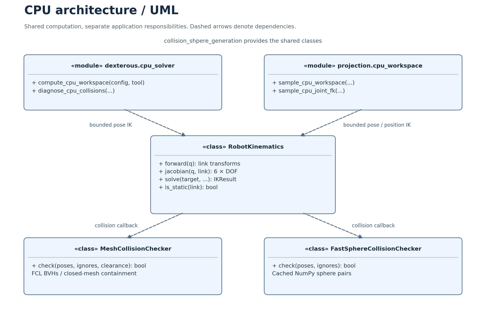
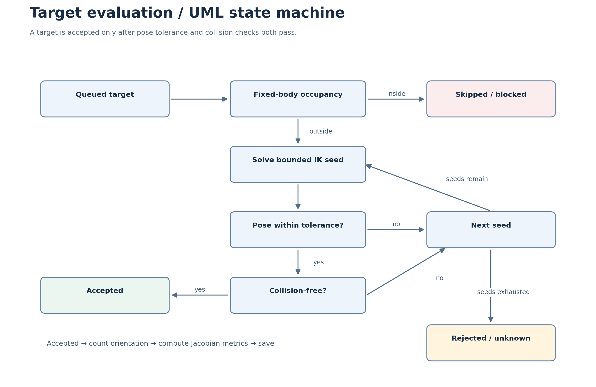

# CPU workspace support and optimization review

The three tools now share a CPU kinematics layer in `collision_shpere_generation`.
CPU solving does not import Torch, cuRobo or Warp. Existing CUDA selection remains
the default; choose `--backend cpu` explicitly or set the YAML backend.

| Tool | CPU computation | Collision representation |
| --- | --- | --- |
| `collision_shpere_generation` | Sphere generation, FK, Jacobian, bounded multi-start IK | Cached NumPy spheres or FCL STL BVHs |
| `robot_workspace_dexterous` | Pose IK, RWS/DWS, manipulability, condition number, singular values | STL/FCL by default; optional spheres |
| `robot_workspace_projection` | Pose/position IK, collision-filtered FK samples, cloud, image and live recomputation | Existing configured sphere model |



## Install and run

From the directory containing the three projects, use a Python environment with
Python 3.10 or newer. Install the local shared package first:

```powershell
python -B -m pip install --no-compile -e ".\collision_shpere_generation[mesh]"
python -B -m pip install --no-compile -e ".\robot_workspace_dexterous[cpu]"
python -B -m pip install --no-compile -e ".\robot_workspace_projection[cpu]"
```

Dexterous workspace:

```powershell
cd robot_workspace_dexterous
python -B run.py --config configs/cpu/spark2_v2.yaml --backend cpu --output-dir output/spark2_cpu
python -B run.py --config configs/cpu/spark2_v2.yaml --backend cpu --diagnose-only --diagnostic-samples 8
```

Projection:

```powershell
cd ..\robot_workspace_projection
python -B run.py --config config.cpu.yaml --backend cpu --generate-only --no-progress-window --cache workspace_cpu.npz
```

Replace `--generate-only` with `--image camera.jpg --output overlay.jpg` for a
static overlay, or omit both for a live camera. CPU selection also applies to
interactive orientation recomputation. A matching cache can render without IK.
The example CPU configurations use coarse grids; refine after a small run.

## What changed

- **Reusable CPU solver:** URDF transforms and analytic Jacobians are parsed
  once. Bounded IK tries multiple seeds, verifies pose tolerances, then rejects
  colliding solutions. Fixed, continuous, prismatic, zero-range, locked and
  affine mimic joints are supported; unrelated arm chains remain in collision FK.
- **Less wasted work:** fixed-body occupied targets are skipped before IK.
  Jacobian SVD runs only on successful candidates. Progress snapshots compress
  once instead of writing, reading and compressing the same arrays twice.
- **Correct shared dexterity:** shared cells intersect the same orientation IDs.
  Taking the minimum of two orientation counts could incorrectly declare
  disjoint orientations shared. Masks are packed into NPZ as
  `orientation_success_bits`; unpack with little-endian bit order and truncate
  to `orientation_count` columns.
- **Portable, consistent cache:** projection signatures hash URDF, YAML and
  referenced sphere contents, solver settings and backend. Paths and file
  timestamps do not identify geometry. Points and their signature are written
  atomically in one NPZ; the JSON sidecar is informational. Old caches rebuild
  once. Camera settings and batch size do not invalidate reachability.
- **Cached collision policy:** FCL reuses BVHs and active pair lists and supports
  an explicit clearance. Separate STL parts keep their closed/open classification.
  Static target filtering bounds temporary memory by the number of spheres.
- **Faster model loading:** large sphere YAML files use the optional LibYAML
  safe loader, with the existing safe Python loader as a fallback.



## Interpretation and remaining improvements

Verified CPU presets (one tested orientation per cell): Spark2 STL accepted
14/25 cells; dual-arm projection accepted 5/25 left-arm and 3/25 right-arm
cells. Separate probes also verified cache reuse and a static image overlay.
All these probes prohibited Torch, cuRobo and Warp imports.
The regression suite passed all 174 tests; the final static-padding checks also
passed. Live camera and Qt viewer interaction were not exercised in the test run.

CPU results use the same grids and tolerances, but a different numerical solver;
CPU and CUDA acceptance sets need not be identical. Rejected targets mean no
accepted sampled solution was found. Increase seeds before concluding that a
region is unreachable. Position/orientation units are metres/radians; mixed
joint types make Jacobian condition numbers dependent on coordinate scaling.

The existing dexterous-tool policy excludes adjacent joint interfaces unless
`--strict-collision` is selected. This removes entire adjacent link pairs,
including potential contacts away from the joint interface. A future policy
should distinguish reviewed interface geometry from other material. Open STL
meshes provide surface checks only.
Projection spheres describe the supplied approximation; internal spheres alone
cannot certify clearance from the original STL surface. Shared dual-arm output
intersects independently solved arm results; it does not solve a simultaneous
two-arm pose constraint.

CPU is practical for small/coarse studies and machines without NVIDIA hardware.
The original Spark2 preset has 55,473 cells and 32 orientations; 8 seeds imply
up to 14,201,088 candidate attempts. Large grids still benefit from CUDA. Next
priorities are resumable snapshots, process workers for CPU sampling, and moving
the collision viewer's mesh queries off its Qt UI thread. Snapshots currently
preserve partial output but cannot resume the solver.

The accompanying [PDF](CPU_WORKSPACE.pdf) includes the same two diagrams.
